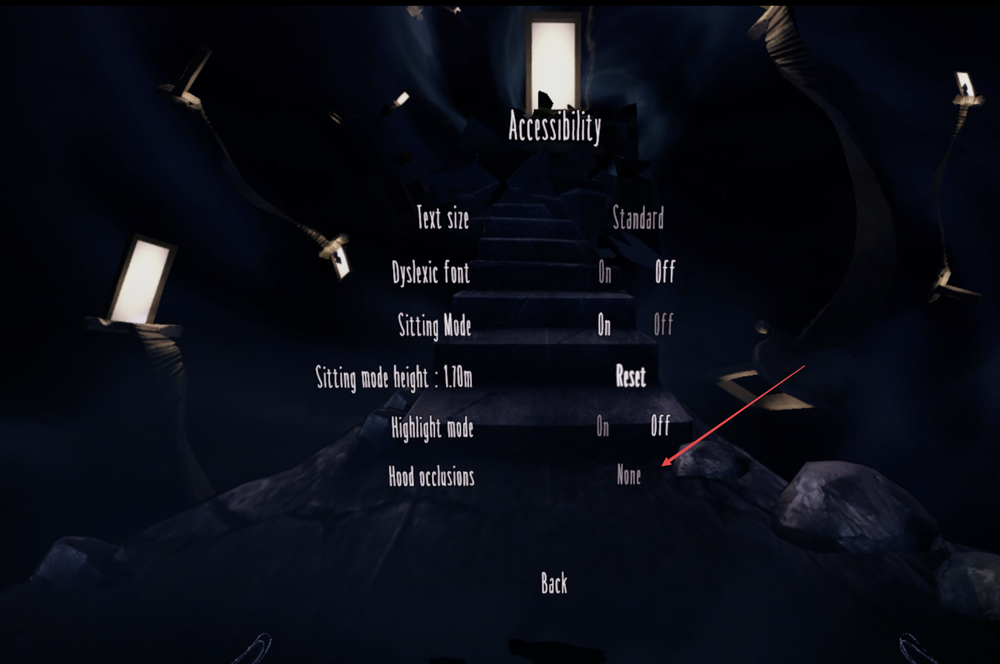
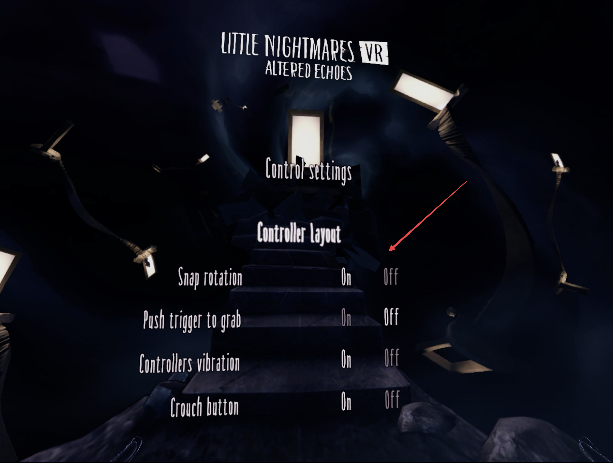

# LNVR Tweaks

A [MelonLoader](https://github.com/LavaGang/MelonLoader) mod for **Little Nightmares VR: Altered Echoes** that adds a proper way to hide the in-view character hood and forces smooth (non-snap) turning, wired into the game's own Accessibility menu.

| Hood occlusions → **None** | Snap rotation → **Off** |
| :---: | :---: |
|  |  |

## What it does

- **Hood occlusion "None"** — adds a fully-hidden state to the existing *Accessibility → Hood occlusions* option. The mod relabels the narrower of the two built-in choices as **"None"** and, when selected, disables the `HoodMesh` that's parented to the VR camera so the top-left of your view isn't covered by a hood silhouette.
- **Smooth turning by default** — pushes `Controls.RotationSnap = false` into the game's native save on startup so the *Controls* menu toggle reflects smooth turning out of the box. The mod also directly enforces `BNG.PlayerRotation.RotationType = Smooth` every ~0.2s so the player controller can't drift back to snap turning on chapter/respawn events.
- **Cranked graphics** *(v1.1)* — enables supersampling, MSAA, longer shadow draw distance, 4096 main-light shadowmap, anisotropic filtering, soft particles, and higher LOD bias by overriding the URP asset, Unity QualitySettings, and XR settings at runtime. Disabled with one config flag if you want stock visuals.
- **Configurable smooth-turn speed and snap amount** — tweak speed and snap-step degrees via the config file.
- **Uses the game's own menu** — changes you make in-game at *Pause → Accessibility* or *Pause → Controls* take precedence until next launch. The mod re-pushes its defaults on each game start, so you always have a predictable baseline.

## Requirements

- **Little Nightmares VR: Altered Echoes** (Steam AppID `2482940`)
- **MelonLoader 0.7.x** (tested with 0.7.2 Open-Beta) — get it from https://melonwiki.xyz/

## Install

1. Install MelonLoader into the game. Run the official **MelonLoader.Installer.exe**, point it at `Little Nightmares VR.exe`, and pick the IL2CPP / net6 runtime when prompted. The installer creates `MelonLoader/`, `Mods/`, `Plugins/`, and a `version.dll` proxy inside the game folder.
2. Launch the game once to let MelonLoader finish generating Il2Cpp interop assemblies. Close it.
3. Download `LNVR_Tweaks.dll` from the [latest release](../../releases/latest).
4. Drop the DLL into the game's `Mods/` folder:
   ```
   <Steam>/steamapps/common/LittleNightmaresVRAlteredEchoes/Mods/LNVR_Tweaks.dll
   ```
5. Launch the game. On the MelonLoader console you should see:
   ```
   [LNVR Tweaks] MelonPreferences Loaded from UserData/LNVR_Tweaks.cfg
   LNVR Tweaks loaded. The game's Accessibility menu's hood occlusion 'Reduced' choice is relabeled to 'None' and now fully hides the hood.
   [LNVR Tweaks] Controls.RotationSnap pushed to save: False (Smooth).
   [LNVR Tweaks] Accessibility.HoodSize initial default pushed to save: 0.
   ```

## Using it in-game

1. Open the pause menu in VR.
2. **Smooth turning** — go to *Controls* and confirm the "Rotation snap" toggle is Off. (It's toggled in-menu just like any other setting — your choice persists for the session.)
3. **Hide the hood** — go to *Accessibility* → *Hood occlusions*. You'll see two choices: **None** (hood fully hidden) and **Standard** (game default). Pick whichever you want.

## Configuration file

First launch creates `UserData/LNVR_Tweaks.cfg` next to the game exe. Edit it to change defaults (takes effect next launch):

```toml
[LNVR_Tweaks]
# Use smooth turning instead of snap turning. Pushed into the game's Controls.RotationSnap
# save on startup; changing it in the game's Options menu takes precedence until next launch.
SmoothTurn = true

# Smooth turn speed in degrees per second. 30–240 is a reasonable range.
SmoothTurnSpeed = 90.0

# Degrees per snap turn (used when SmoothTurn is false).
SnapTurnAmount = 45.0

# If true and the user hasn't otherwise chosen in the Accessibility menu yet, hide the hood.
# Once the user picks "None" or "Standard" in-menu, that choice takes over.
HideHoodByDefault = true

[LNVR_Tweaks_Graphics]
# Master switch. Set to false to leave the game's stock graphics settings alone.
Enabled = true

# URP render scale (UniversalRenderPipelineAsset.renderScale).
# 1.0 = native, 1.5 ≈ 2.25× pixels, 2.0 = 4× pixels (very heavy on GPU).
# Default 1.5 is a noticeable sharpness bump on most GPUs.
RenderScale = 1.5

# XR-side supersampling (XRSettings.eyeTextureResolutionScale). Multiplies on top of
# RenderScale, so leave at 1.0 unless you have GPU headroom — both stack.
EyeTextureScale = 1.0

# MSAA: 1 = off, 2 = 2×, 4 = 4×, 8 = 8×. URP MSAA. Cheap edge-cleanup vs supersampling.
MSAA = 4

# Shadow draw distance in meters. Game ships 25m. 60–100m looks better in open spaces.
ShadowDistance = 60.0

# Main directional light shadowmap resolution. 1024 / 2048 / 4096. Game ships 1024.
MainShadowResolution = 4096

# Additional (point/spot) shadowmap resolution. Game already ships 4096.
AdditionalShadowResolution = 4096

# Number of shadow cascades for the main light: 1, 2, or 4. Game ships 4 already.
ShadowCascades = 4

# URP soft shadow filtering. Game ships true.
SoftShadows = true

# HDR rendering. Required for proper bloom/tonemap. Game ships true.
HDR = true

# Force anisotropic filtering on every texture (sharper at oblique angles).
ForceAnisotropic = true

# Soft particles fade where they intersect geometry instead of hard-clipping.
SoftParticles = true

# Realtime reflection probe updates. Game ships true.
RealtimeReflectionProbes = true

# Global LOD bias — distance multiplier before the engine swaps to a lower-detail mesh.
# Higher = full-detail meshes stay visible further away.
LODBias = 2.0
```

## How it works (under the hood)

- The game ships with a `HoodSize` ButtonSelector in the Accessibility menu that only has two localized choices (`Reduced` / `Standard`). The mod polls the widget at 5Hz and overrides the displayed TextMeshPro text of choice 0 to read "None".
- Hood visibility is enforced live via `GameObject.SetActive` on `AddressableSceneContentLoader/Bootstrap_Addressable (Clone)/Player/PlayerController/CameraRig/TrackingSpace/CenterEyeAnchor/Camera/HoodMesh`. This survives chapter transitions, cinematics, and respawns that would otherwise re-enable the hood.
- Rotation mode is enforced on `Il2CppBNG.PlayerRotation.RotationType`. The native `Controls_RotationSnap` save is written once on startup so the in-game Controls menu reflects the correct state.
- Changes made in the game's own Options menu take precedence during the session — the mod reads the ButtonSelector's `_currentChoice` each tick.

## Uninstall

Delete `Mods/LNVR_Tweaks.dll`. Optionally delete `UserData/LNVR_Tweaks.cfg`. If you want to fully remove MelonLoader too, re-run the MelonLoader installer and pick "Un-Install".

## Build from source

Requires .NET 6 SDK.

```bash
git clone https://github.com/elliotttate/LNVR_Tweaks.git
cd LNVR_Tweaks/LNVR_Tweaks
# If your game is installed elsewhere, edit <GamePath> in LNVR_Tweaks.csproj
dotnet build -c Release
```

Output: `LNVR_Tweaks/bin/Release/net6.0/LNVR_Tweaks.dll`.

The csproj pulls MelonLoader, Il2CppInterop, and stripped Il2Cpp game assemblies from the game's `MelonLoader/net6/` and `MelonLoader/Il2CppAssemblies/` folders — the game must have been launched under MelonLoader at least once so those assemblies exist.

## License

MIT — see [LICENSE](LICENSE).

## Acknowledgments

- [MelonLoader](https://github.com/LavaGang/MelonLoader) — the IL2CPP mod loader that makes this possible.
- [Il2CppInterop](https://github.com/BepInEx/Il2CppInterop) — the interop layer that exposes stripped game types to managed C#.
- The game's own `Accessibility_HoodSize` and `Controls_RotationSnap` backing save entries, which made this a much simpler mod than it would have been otherwise.
